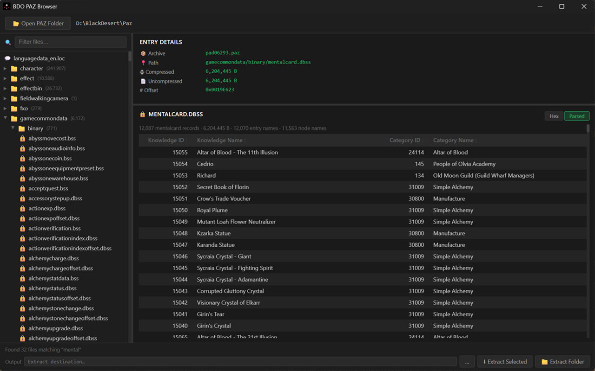

# BDO PAZ Browser & Binary Format Tools

> **Work in progress.** Format coverage is incomplete and the API may change. Contributions and corrections are welcome.

A Python tool for browsing, extracting, and previewing files from **Black Desert Online**'s `.paz` game archives, with a plugin system for parsing BDO-specific binary formats.



---

## Features

- **GUI browser** — tree-view file explorer for the full PAZ archive, with live search and file preview
- **CLI extraction** — extract files by name or glob pattern without opening the GUI
- **File preview** — text, hex dump, DDS images, and parsed binary tables for known formats
- **Paged preview** — large files (hex and parsed tabs) are paged; navigate with Prev/Next without loading the full DOM
- **Tab search** — Ctrl+F inline search within hex (byte offset) and parsed (record) tabs; string and hex-pattern modes
- **Export** — save the current file as raw binary (hex tab) or CSV (parsed tab) via the Entry Details panel
- **Plugin system** — add handlers for new binary formats by dropping a file into `handlers/`
- **Caching** — PAZ index is parsed once and cached; subsequent launches load instantly

---

## Contributing Format Coverage

BDO has hundreds of undocumented binary formats — contributions and corrections are welcome.

**Reverse engineer a new format** — open a new issue using the [file format template](../../issues/new?template=file-format.yml) and title it `filename.ext` (e.g. `yachtdicepreset.dbss` or `.pac`).

**Improve existing docs** — the format docs in [`docs/file-formats/`](docs/file-formats/) are not all complete. Each doc has an **Open Questions** section listing specific unknowns — if you can answer any of them, feel free to update the doc directly.

**Translate the UI** — UI strings live in [`PAZ-Parser/ui/lang/`](PAZ-Parser/ui/lang/) as small JSON files, one per language. Missing keys fall back to English automatically, so partial translations are fine. See [`TRANSLATING.md`](PAZ-Parser/ui/lang/TRANSLATING.md) for instructions.

---

## Writing a Preview Handler

Drop a `.py` file (not starting with `_`) into `handlers/` — it is auto-loaded at startup.

All parsed-view handlers must implement two methods:

```python
# handlers/myformat_handler.py
from bdo_preview import PreviewHandler, register_handler
from bdo_models import PazEntry

class MyFormatHandler(PreviewHandler):
    def get_records(self, data: bytes, entry: PazEntry, companions: dict[str, bytes]) -> list[dict]:
        # Parse all records once. Returns plain dicts — no HTML.
        # Cached in memory for paging, tab search, and CSV export.
        return [{"id": r.id, "name": r.name} for r in parse(data)]

    def render_records_page(self, records: list[dict], page: int, page_size: int) -> str:
        # Render one page of records as an HTML fragment.
        start = page * page_size
        slice_ = records[start : start + page_size]
        rows = "".join(f"<tr><td>{r['id']}</td><td>{r['name']}</td></tr>" for r in slice_)
        return f"<table><thead>...</thead><tbody>{rows}</tbody></table>"

register_handler("myfile.dbss", MyFormatHandler())
```

The browser automatically handles:

- Prev/Next page navigation
- Inline tab search (Ctrl+F) across all record field values
- CSV export of the full record list

See [docs/handler.md](docs/handler.md) for the full guide, including companion files, shared helpers, registration patterns, and [adding translations](docs/handler.md#localization).

> **Tip:** Press **Ctrl+R** in the GUI to reload all handlers without restarting the app. If you have a file open on the Parsed tab, the preview re-renders automatically with the updated handler.

---

## Supported Formats

- Handler Supported 5/399 .bss formats.
- Handler Supported 34/375 .dbss formats.
- Handler Supported 23/23 other formats.

## Documented Formats

| File                            | Description                                                                                                | Docs                                                               |
| ------------------------------- | ---------------------------------------------------------------------------------------------------------- | ------------------------------------------------------------------ |
| `acceptquest.bss`               | PABR quest ID list in acceptance-related order with two side fields                                        | [acceptquest](docs/file-formats/acceptquest_bss.md)                |
| `allquestlist.bss`              | PABR list of canonical/display packed quest IDs linked to quest LOC keys                                   | [allquestlist](docs/file-formats/allquestlist_bss.md)              |
| `characterspawntype.dbss`       | Entity spawn-type flag table — 44 boolean attributes per entity                                            | [characterspawntype](docs/file-formats/characterspawntype_dbss.md) |
| `characterspawntypeoffset.dbss` | PABR index into `characterspawntype.dbss` — maps entity id_low16 → offset/size                             | [characterspawntype](docs/file-formats/characterspawntype_dbss.md) |
| `characterstatic.dbss`          | Variable-length character/NPC static records with inline action scripts                                    | [characterstatic](docs/file-formats/characterstatic_dbss.md)       |
| `characterstaticoffset.dbss`    | PABR index into `characterstatic.dbss` — maps character id → payload offset                                | [characterstatic](docs/file-formats/characterstatic_dbss.md)       |
| `completequest.bss`             | PABR quest ID list in completion-related order with two side fields                                        | [completequest](docs/file-formats/completequest_bss.md)            |
| `knowledgelearning.dbss`        | Knowledge unlock trigger definitions — maps knowledge IDs to trigger type (`kind`) and associated index ID | [knowledgelearning](docs/file-formats/knowledgelearning_dbss.md)   |
| `knowledgelearningoffset.dbss`  | Offset index into `knowledgelearning.dbss` — provides byte offset, kind, idx                               | [knowledgelearning](docs/file-formats/knowledgelearning_dbss.md)   |
| `languagedata_en.loc`           | Localization string table (zlib-compressed, UTF-16-LE)                                                     | [loc](docs/file-formats/languagedata_loc.md)                       |
| `mainquest.bss`                 | PABR main-quest UI sequence groups with quest references and UTF-16 text payload                           | [mainquest](docs/file-formats/mainquest_bss.md)                    |
| `mentalcard.dbss`               | Knowledge entry → node/category ID mapping                                                                 | [mentalcard](docs/file-formats/mentalcard_dbss.md)                 |
| `mentalcardoffset.dbss`         | Offset index into `mentalcard.dbss` — provides byte offset and block size                                  | [mentalcard](docs/file-formats/mentalcard_dbss.md)                 |
| `mentaltheme.dbss`              | Knowledge group/category tree with rewards, entries, and child themes                                      | [mentaltheme](docs/file-formats/mentaltheme_dbss.md)               |
| `mentalthemeoffset.dbss`        | Offset index into `mentaltheme.dbss` — maps theme ID → payload offset/size                                 | [mentaltheme](docs/file-formats/mentaltheme_dbss.md)               |
| `newquest.bss`                  | PABR new-quest UI sequence groups with quest references and UTF-16 text payload                            | [newquest](docs/file-formats/newquest_bss.md)                      |
| `npcgift.dbss`                  | NPC gift item table + confession-response dialogue                                                         | [npcgift](docs/file-formats/npcgift_dbss.md)                       |
| `npcgiftdata.dbss`              | NPC confession-response dialogue records (variable-length, Korean UTF-16)                                  | [npcgift](docs/file-formats/npcgift_dbss.md)                       |
| `npcgiftdataoffset.dbss`        | ID-keyed index into `npcgiftdata.dbss`                                                                     | [npcgift](docs/file-formats/npcgift_dbss.md)                       |
| `npcgiftetc.bss`                | PABR global gift-system config block (32 bytes)                                                            | [npcgiftetc](docs/file-formats/npcgiftetc_bss.md)                  |
| `npcgiftoffset.dbss`            | ID-keyed index into `npcgift.dbss`                                                                         | [npcgift](docs/file-formats/npcgift_dbss.md)                       |
| `npcpersonality.dbss`           | NPC personality ID → type refs + behavioural float params                                                  | [npcpersonality](docs/file-formats/npcpersonality_dbss.md)         |
| `npcpersonalityoffset.dbss`     | ID-keyed sequential index into `npcpersonality.dbss`                                                       | [npcpersonality](docs/file-formats/npcpersonality_dbss.md)         |
| `petaction.dbss`                | Pet action icon records with UTF-16 DDS paths for commands/reactions                                       | [petaction](docs/file-formats/petaction_dbss.md)                   |
| `petactionoffset.dbss`          | Keyed offset index into `petaction.dbss`                                                                   | [petaction](docs/file-formats/petaction_dbss.md)                   |
| `petexp.dbss`                   | Pet experience tables keyed by EXP table ID, with per-level u64 thresholds                                | [petexp](docs/file-formats/petexp_dbss.md)                         |
| `petexpoffset.dbss`             | Keyed offset index into `petexp.dbss`                                                                      | [petexp](docs/file-formats/petexp_dbss.md)                         |
| `plantzone.dbss`                | Variable-length plant-zone records with a required offset table                                            | [plantzone](docs/file-formats/plantzone_dbss.md)                   |
| `plantzoneoffset.dbss`          | Offset index into `plantzone.dbss` — maps record ID → byte offset/size                                     | [plantzone](docs/file-formats/plantzone_dbss.md)                   |
| `quest.dbss`                    | Variable-length quest definitions with scripts, objectives, and icon paths                                 | [quest](docs/file-formats/quest_dbss.md)                           |
| `questgroup.dbss`               | Quest chain/group table with Korean names and child quest ID links                                         | [questgroup](docs/file-formats/questgroup_dbss.md)                 |
| `title.dbss`                    | Title record table (multiple layouts, embedded PAColor text)                                               | [title](docs/file-formats/title_dbss.md)                           |
| `titlebufflist.dbss`            | Title collection buff rewards (KR text + LOC tooltip match)                                                | [titlebufflist](docs/file-formats/titlebufflist_dbss.md)           |
| `titlebufflistoffset.dbss`      | Offset index into `titlebufflist.dbss` — maps entry ID → byte offset/size                                  | [titlebufflist](docs/file-formats/titlebufflist_dbss.md)           |
| `titlecategory.bss`             | Groups titles into display categories                                                                      | [titlecategory](docs/file-formats/titlecategory_bss.md)            |
| `titleoffset.dbss`              | Index into `title.dbss` — maps title ID → offset/size                                                      | [titleoffset](docs/file-formats/titleoffset_dbss.md)               |
| `worldquest.dbss`               | Empty world quest table placeholder with a zero record count                                               | [worldquest](docs/file-formats/worldquest_dbss.md)                 |
| `zodiacsign.dbss`               | Zodiac sign definitions — star coords, names, texture paths                                                | [zodiacsign](docs/file-formats/zodiacsign_dbss.md)                 |
| `zodiacsignindex.bss`           | PABR display-order index mapping slot → zodiac ID for the 12 horoscope signs                               | [zodiacsignindex](docs/file-formats/zodiacsignindex_bss.md)        |
| `zodiacsignoffset.dbss`         | ID-keyed index into `zodiacsign.dbss` — 9-byte rows (u8 id + u32 offset/size)                              | [zodiacsign](docs/file-formats/zodiacsign_dbss.md)                 |
| `zodiacsignorder.dbss`          | Per-personality-type constellation drawing-order sequences (24 records)                                    | [zodiacsign](docs/file-formats/zodiacsign_dbss.md)                 |
| `zodiacsignorderoffset.dbss`    | ID-keyed index into `zodiacsignorder.dbss` — maps personality type → offset                                | [zodiacsign](docs/file-formats/zodiacsign_dbss.md)                 |

All formats are little-endian. Unknown fields are named `unknown_*`.

---

## Requirements

- Python 3.10+
- [pywebview](https://pywebview.flowrl.com/) — GUI shell
- [Pillow](https://python-pillow.org/) — optional, for DDS image preview

```
pip install pywebview
pip install pillow        # optional
```

Or install from the provided requirements file:

```
pip install -r PAZ-Parser/requirements.txt
```

---

## Testing

Handler unit tests use pytest and live beside the handler they cover. Missing test inputs are fetched into the gitignored `PAZ-Parser/tests/fixtures/` cache from the configured PAZ folder.

Install dev dependencies:

```bash
python -m pip install -r PAZ-Parser/requirements-dev.txt
```

Run all unit tests:

```bash
python -m pytest -v -s
```

Open a PAZ folder once in the GUI if fixture fetching has no saved game path yet.

---

## Usage

### GUI

```bash
python browser.py
```

On first launch, click **Open Folder** and select your BDO PAZ directory (typically `Black Desert/Paz`). The index is parsed and cached — subsequent launches load from cache automatically.

### CLI

```bash
# List files matching a pattern
python browser.py --paz-folder "C:/Games/Black Desert/Paz" --list "title*.dbss"

# Extract files matching a pattern
python browser.py --paz-folder "C:/Games/Black Desert/Paz" --file "title.dbss" --output ./out

# Glob extraction
python browser.py --paz-folder "C:/Games/Black Desert/Paz" --file "*title*" --output ./out
```

If `--paz-folder` is omitted, the CLI reuses the last folder opened in the GUI.

---

## Project Structure

```
PAZ-Parser/
├── bdo_app.py              # Entry point — GUI + CLI
├── bdo_models.py           # Data models (shared by all handlers)
├── bdo_preview.py          # Preview handler registry + built-in handlers
├── bdo_server.py           # Local HTTP server for stream preview
├── conftest.py             # pytest setup and handler test summary output
│
├── api/                    # pywebview JS API bridge
│   ├── bdo_api.py          # Routing and dispatch
│   ├── bdo_api_helpers.py  # Shared constants and utilities (_norm, _file_icon)
│   ├── bdo_api_preview.py  # Preview assembly and entry loading (PreviewMixin)
│   └── bdo_api_search.py   # File content search — single-file and cross-file (SearchMixin)
│
├── paz/                    # PAZ archive reading and caching
│   ├── bdo_cache.py        # PAZ index cache
│   ├── bdo_ice.py          # ICE cipher implementation
│   ├── bdo_meta_reader.py  # Meta file reader
│   ├── bdo_payload_cache.py# LRU payload cache
│   ├── bdo_payload_reader.py# Payload decompression + ICE decryption
│   ├── bdo_paz_extract.py  # File extraction logic
│   └── bdo_paz_reader.py   # PAZ archive parser
│
├── tests/                  # Unit test framework and gitignored fixtures
│   ├── framework.py        # Public re-export for test helpers
│   ├── specs.py            # CountTest, PosTest, TargetTest, SchemaTest, RangeTest
│   ├── models.py           # HandlerCase, HandlerResult
│   ├── runner.py           # run_case()
│   ├── fixtures.py         # Auto-fetches test inputs from PAZ folder
│   └── fixtures/           # Gitignored cached binaries
│
├── ui/                     # Web UI (HTML + JS + CSS)
│   ├── index.html
│   ├── app.js              # Entry point — assembles feature modules
│   ├── style.css           # CSS entry point — imports css/ modules
│   ├── css/                # Per-component stylesheets (numbered load order)
│   └── js/
│       ├── core/           # Shared state and helpers
│       └── features/       # Feature modules (tree, search, extraction, …)
│
└── handlers/               # Format preview plugins (auto-loaded)
    ├── dbss_handler.py     # DBSS entry point
    ├── _dbss/              # DBSS format implementations
    │   ├── common/         # Shared binary/HTML helpers
    │   ├── title/
    │   ├── titleoffset/
    │   ├── titlebuff/
    │   ├── mentalcard/
    │   ├── mentaltheme/
    │   ├── knowledgelearning/
    │   ├── npcgift/
    │   ├── quest/
    │   └── questgroup/
    └── _common/            # Helpers shared across formats
        └── loc.py

docs/
├── handler.md              # Guide for writing preview handlers
├── style-guide.md          # UI color palette and component reference
└── file-formats/           # Per-format binary layout documentation
```

---

## Disclaimer

This project is for research purposes only. BDO game data is copyright Pearl Abyss. Do not redistribute extracted game assets.
