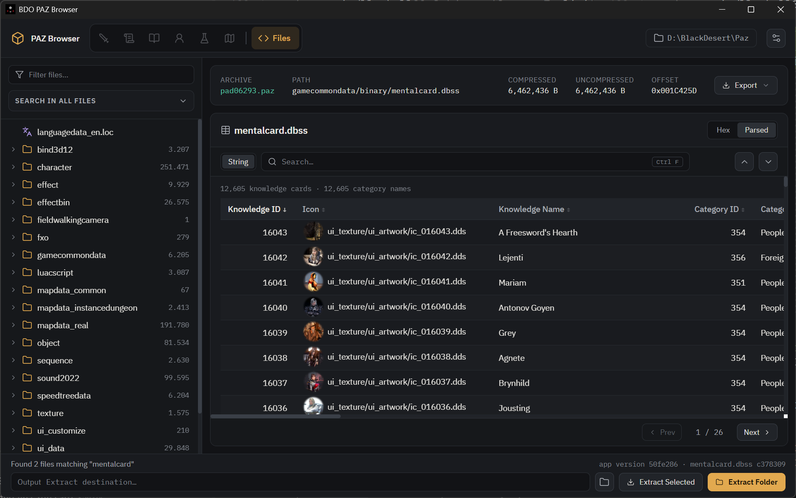

# BDO PAZ Browser & Binary Format Tools

> **Work in progress.** Format coverage is incomplete and the API may change. Contributions and corrections are welcome.

A Python tool for browsing, extracting, and previewing files from Black Desert Online's `.paz` game archives, with a plugin system for parsing BDO-specific binary formats.



## Download

For Windows 10 and 11: download `BDO-PAZ-Browser-v<version>-windows.zip` from the
[latest release](../../releases/latest), unzip it into a folder you can write
to, and run `BDO-PAZ-Browser.exe`. The zip holds `BDO-PAZ-Browser.exe`,
`bdo-paz-cli.exe` (the command-line version, see [CLI](#cli)) and the
`_internal` folder both need.

- The exe is not code-signed, so SmartScreen warns on the first start: click
  **More info**, then **Run anyway**. Each release has a `.sha256` file to check
  the download with `certutil -hashfile <zip> SHA256`.
- The window uses Microsoft Edge WebView2, which Windows 10 and 11 already have.
- Settings and caches go into a `data` folder next to the exe, so moving or
  deleting the folder takes them along. A folder the exe can't write to, such as
  one in Program Files, uses `%LOCALAPPDATA%\BDO-PAZ-Browser` instead.
- A newer release shows up as a green notice next to the settings button;
  **Update** installs it in a few seconds and keeps `data`. From the command line:
  `bdo-paz-cli.exe --update-app`.
- New and fixed handlers come without a new release: on start the app
  downloads the changed handler files in the background, then offers a restart
  to use them. From the command line: `bdo-paz-cli.exe --update-handlers`.
- On start the app contacts GitHub twice: the releases API for a newer release
  and the `handlers-latest` release for a newer handler pack. Turn off **Check
  for updates on start** and **Update handlers on start** in the settings and it
  stays offline.
- The bottom bar shows the version, `app version v2026.10.12`, and with a
  parsed file selected the version of its handler, `buffsimply.bss 2026.10.14`.
  From source both are commits: the checkout's, and the last commit that
  changed the handler's files (with a `+` for uncommitted edits). The bug
  report form asks for both.

To run from source or write handlers, see [Requirements](#requirements).

## Features

- **GUI browser**: tree-view file explorer for the full PAZ archive, with live search and file preview
- **CLI extraction**: extract files by name or glob pattern without opening the GUI
- **File preview**: text, hex dump, DDS images, and parsed binary tables for known formats
- **Paged preview**: large files (hex and parsed tabs) are paged; navigate with Prev/Next without loading the full DOM
- **Sortable tables**: click a column header to sort the whole parsed table, not just the page on screen; a table opens sorted by its first column, highest first, until you click another sort, which is remembered per file
- **Tab search**: Ctrl+F inline search within hex (byte offset) and parsed (record) tabs; string and hex-pattern modes
- **Export**: save the current file as raw binary (hex tab) or CSV (parsed tab) via the Entry Details panel
- **Game text colours**: LOC text shows the colours of its `<PAColor>` tags, as in game; the **Show game text tags** setting (off by default) also shows the tags themselves
- **Handled tables only**: the **Show only handled tables** setting (off by default) limits the file tree, file search, content search and folder extraction to files with a parsed table view, plus the LOC file
- **Languages**: the language setting picks both the UI text and the LOC file the tables read game text from (`ads/languagedata_<code>.loc`), which also sits at the top of the file tree and follows a language switch. A client ships only its region's LOC files; when the picked language's file is missing, a corner warning says only the UI is in that language and the tables show their Korean text. Dismissing it keeps it closed for that language, and the settings still mark the language with a ⚠ icon
- **Plugin system**: add handlers for new binary formats by dropping a file into `handlers/`
- **Caching**: the PAZ index is parsed once and cached; later launches read it from the cache. Every cache lives outside the game folder, in the `cache` folder of the data folder with one subfolder per PAZ folder, so a test client keeps its own. Caches an older version left next to the PAZ files move over on the next start
- **Data folder**: settings (`paz_config.json`) and caches live in `%LOCALAPPDATA%\BDO-PAZ-Browser` when running from source, and in `data\` next to the exe in the Windows build, so the unzipped folder holds everything (an exe folder that can't be written, such as one in Program Files, falls back to `%LOCALAPPDATA%`). The **Data Folder** setting picks another folder: the settings are copied there (replacing any already in it, the old copy stays), the caches in the old folder are deleted, and the loaded client's PAZ index is saved again in the new one. A picked folder that is gone, such as an unplugged drive, is replaced by the default until it is back. Settings an older version kept next to the code move over on the next start. The settings file carries a `config_version`: a newer app updates older settings on load, settings it can't read are renamed to `paz_config.backup.json` and the app starts with defaults, and an older app reads newer settings as they are and keeps their keys
- **App updates** (Windows exe): on start the app asks GitHub for a newer release (the **Check for updates on start** setting, on by default) and shows a banner. Its popup lists the release notes, with **Update** and **Open on GitHub**. **Update** downloads the release zip, checks its SHA-256, closes the app and swaps the new version in: `data` moves along, and when the new `bdo-paz-cli.exe --handlers` fails, the old version is put back. Nothing updates without a click. From source, update with `git pull`
- **Handler updates** (Windows exe): handlers ship apart from the exe as handler packs, the `handlers/` folder of one commit with a `manifest.json` (SHA-256 per file, the `HANDLER_API` it needs, each handler's version). On start the app reads the manifest of the `handlers-latest` release (the **Update handlers on start** setting, on by default; **Check now** runs it at once). For a newer pack it copies the unchanged files from the running pack, downloads the changed ones from GitHub, checks every hash and that the pack loads in `bdo-paz-cli.exe --handlers`, and then offers **Restart now**. A pack for another `HANDLER_API` needs a newer app first; a pack that fails to load is never tried again and the app keeps its own handlers. Packs live in `handlers\` in the data folder. A handler's version is the pack in which its code, or a `_common` module it imports, last changed
- **Parsed table cache**: parsed tables are kept on disk, so a big table reopens in a fraction of its parse time (`detail_dialog.dbss` 1.3 s to 0.25 s, `itemenchant.dbss` with its default sort 2.1 s to 0.5 s). The **Parsed Table Cache** setting picks Off, Cache tables when opened (default) or Cache all tables in the background, which parses every table A to Z while the app is idle; the status bar shows the table it is on, how far the pass is, and when it waits for you. A table stays cached across a patch that leaves it, its companions and the LOC text or lookup indexes it reads unchanged. **Delete all caches** in the settings removes the parsed table, icon thumbnail and lookup index caches; the PAZ index cache stays, since rebuilding it takes over a minute. In the background mode, the pass then waits for the next start instead of filling the cache again right away

## Contributing Format Coverage

BDO has hundreds of undocumented binary formats. Contributions and corrections are welcome.

**Reverse engineer a new format**: open a new issue using the [file format template](../../issues/new?template=file-format.yml) and title it `filename.ext` (e.g. `yachtdicepreset.dbss` or `.pac`).

**Improve existing docs**: the format docs in [`docs/file-formats/`](docs/file-formats/) are not all complete. Each doc has an **Open Questions** section listing specific unknowns. If you can answer any of them, update the doc directly.

**Translate the UI**: UI strings live in [`PAZ-Parser/ui/lang/`](PAZ-Parser/ui/lang/) as small JSON files, one per language. Missing keys fall back to English automatically, so partial translations are fine. See [`TRANSLATING.md`](PAZ-Parser/ui/lang/TRANSLATING.md) for instructions.

See [`CONTRIBUTING.md`](CONTRIBUTING.md) for setup, the checks to run before a pull request, and project conventions.

## Writing a Preview Handler

Drop a `.py` file (not starting with `_`) into `handlers/`. It is auto-loaded at startup.

All parsed-view handlers must implement two methods:

```python
# handlers/myformat_handler.py
from bdo_preview import PreviewHandler, register_handler
from bdo_models import PazEntry

class MyFormatHandler(PreviewHandler):
    def get_records(self, data: bytes, entry: PazEntry, companions: dict[str, bytes]) -> list[dict]:
        # Parse all records once. Returns plain dicts, no HTML.
        # Cached in memory for paging, tab search, and CSV export.
        return [{"id": r.id, "name": r.name} for r in parse(data)]

    def render_records_page(self, records: list[dict], page: int, page_size: int) -> str:
        # Render one page of records as an HTML fragment.
        start = page * page_size
        slice_ = records[start : start + page_size]
        rows = "".join(f"<tr><td>{r['id']}</td><td>{r['name']}</td></tr>" for r in slice_)
        return f"<table><thead>...</thead><tbody>{rows}</tbody></table>"

register_handler("myfile.dbss", MyFormatHandler())
```

The browser automatically handles:

- Prev/Next page navigation
- Inline tab search (Ctrl+F) across all record field values
- CSV export of the full record list

See [docs/handler.md](docs/handler.md) for the full guide, including companion files, shared helpers, registration patterns, and [adding translations](docs/handler.md#localization).

> **Tip:** Press **Ctrl+R** in the GUI to reload all handlers without restarting the app. If you have a file open on the Parsed tab, the preview re-renders automatically with the updated handler.

## Supported Formats

- Handler Supported 44/401 .bss formats.
- Handler Supported 87/374 .dbss formats.
- Handler Supported 24 other formats.

## Documented Formats

See [docs/documented-formats.md](docs/documented-formats.md) for the full table.

## Requirements

- Python 3.14
- [pywebview](https://pywebview.flowrl.com/) for the GUI shell
- [aiohttp](https://docs.aiohttp.org/) for the local stream server
- [numpy](https://numpy.org/) for ICE decryption
- [Pillow](https://python-pillow.org/) for DDS image preview (optional)

```
pip install -r PAZ-Parser/requirements.txt
pip install pillow        # optional
```

## Testing

Handler unit tests use pytest and live beside the handler they cover. Missing test inputs are fetched into the gitignored `PAZ-Parser/tests/fixtures/` cache from the configured PAZ folder. When the installed client changes, the next run fetches all of them again (details in `docs/handler.md`).

Install dev dependencies:

```bash
python -m pip install -r PAZ-Parser/requirements-dev.txt
```

Run all unit tests with the full output (a rows / parse time / LOC summary per handler):

```bash
python -m pytest -v -s
```

Or print only failed tests and a pass/total line:

```bash
python -m pytest --clean
```

Open a PAZ folder once in the GUI if fixture fetching has no saved game path yet. Without one, the tests that need game files are skipped and the rest still run, which is what CI does.

Every pull request into `staging` or `main`, and every push to `staging` that changes code or test config, runs pyright and the tests on a Windows runner (`.github/workflows/ci.yml`). The runner has no client, so it covers only the tests that need no game files; run the full suite locally before opening a pull request.

Type-check `PAZ-Parser/`, `browser.py` and `benchmark.py` (from the repo root, so `pyrightconfig.json` applies):

```bash
python -m pyright
```

Run both the tests and pyright before committing a Python change; both should pass with no errors.

## Benchmarking

`benchmark.py` times the decode path, and a handler's parse, on fixed input,
so two runs on the same machine can be compared.

```bash
# Time every stage of one entry and save the result
python benchmark.py run --output before.json

# Extract every file of one .paz archive, as extract_all does
python benchmark.py run --archive --repeats 5 --output before.json

# Parse one table with LOC and lookup indexes loaded, as the app does
python benchmark.py run --entry itemenchant.dbss --stages parse --output before.json

# Rebuild the client's file index, as the app does after a patch
python benchmark.py run --index --repeats 3 --output before.json

# Build the LOC text index, as every start does (default: the app's language)
python benchmark.py run --loc --output before.json

# Load the entry list from its cache and build the tree, as every start does
python benchmark.py run --folder --output before.json

# After a change: same command, then compare stage by stage
python benchmark.py run --output after.json
python benchmark.py compare before.json after.json

# Where the time goes: cProfile, top 100 functions by cumulative time
python benchmark.py profile --archive --stages extract --save extract.prof
```

The workload is one entry (`--entry`, default
`morningland_boss_03_02_full.dds`, a 14 MB texture), one archive
(`--archive`, default `pad05889.paz`, about 800 mixed files) or the client's
file index (`--index`), one LOC file (`--loc`, optionally a language code
such as `--loc de`) or the folder's entry list (`--folder`). The stages:

| Stage | What it times |
|---|---|
| `decrypt` | ICE decryption of the entry, from memory |
| `decompress` | BDO decompression of the decrypted entry, from memory |
| `read` | The app's path to open a file: disk read, decrypt, decompress |
| `extract` | `extract_all` per file: `read`, then the size check and the write to disk. On an archive, every file in it. The meta file parse is left out: it reads the file table of every archive on every call (the `index` stage) and would hide the decode time |
| `parse` | The handler's `all_records()` (the cached `get_records()` the app's table uses) on the decoded entry, with its companions, LOC in the language picked in the app and the lookup indexes loaded. Only for a file with a parsed view; LOC and the indexes add about 5 s to start-up, so they only load when this stage runs. Every run parses cold (the handler's cached records and index are dropped first) and runs with the garbage collector on, as in the app, which pauses it while the records are built. The input hash covers the entry only, not its companions or LOC |
| `index` | `--index` only: the `.meta` file parse, which reads the file table and decrypts the path block of every archive, with the garbage collector on. The app runs it when its index cache is out of date. The warm-up leaves every archive header in the OS file cache, so the timed runs are warm (about 2 s on client 3458); a cold parse right after a reboot reads 11,000 archives from disk and takes about a minute. For a cold figure, run `--warmup 0 --repeats 1` first thing after a reboot. The input hash is the meta file's |
| `loc` | `--loc` only: `init_loc()` on the LOC file's bytes in memory, the decompress and the text index every table's game text comes from, which the app builds on every start and language switch. With the garbage collector on, as in the app |
| `entries` | `--folder` only: what a start does before the page gets the tree. It loads the entry list from the PAZ index cache and builds the entry maps and the tree, without LOC (`loc`) and the lookup indexes. With the garbage collector on, as in the app. Needs an index cache that matches the client, so open the folder once first. The input hash is the cache file's |

To keep numbers comparable, each run:

- **Pins the process to one CPU** (`--cpu`, default 2) at high priority.
  The decode loops run on one core anyway (ICE through numpy, decompression
  in pure Python). Pinning
  stops the OS moving the run between cores; on a hybrid Intel CPU an
  efficiency core runs this code about 1.8x slower, so the benchmark refuses
  one and lists the performance cores. The pin is read back after setting
  it and checked again at the end. `--no-pin` runs unpinned and marks the
  result so. Pinning works on Windows and Linux (Linux without the priority
  raise, which needs root).
- **Keeps the input fixed**: the entry bytes are read into memory once, and
  their SHA-256 is saved so a client patch that changes the file shows up.
- **Warms up first** (`--warmup`, default 1), then times `--repeats` runs
  (default 5) with the garbage collector off, as `timeit` does (`parse`
  keeps it on). What a run returns is freed after the clock stops. The minimum
  is the steadiest figure for CPU-bound code; the median and spread show the
  noise.
- **Saves a fingerprint** with the timings: CPU model, logical CPUs, RAM,
  power plan, OS, Python, git commit, the pinned CPU and the input hash.
  `compare` lists every difference besides the code, so a speedup only
  counts when that list is empty.

`--memory` adds one run per stage under `tracemalloc` for the peak memory.
It traces every allocation, so that run is many times slower and never
shares a run with the timings. `profile` slows every call too; use it to find
hot functions, and `run` for numbers. Its `--save` file opens in snakeviz or
`pstats`.

## Building the Windows Exe

The Windows build is a folder with `BDO-PAZ-Browser.exe` (the GUI),
`bdo-paz-cli.exe` (the same commands as `browser.py`, with console output) and
the `_internal` folder they share. To build it yourself, on Windows:

```bash
python -m pip install -r PAZ-Parser/requirements-build.txt
python build.py
```

`build.py` runs PyInstaller with `browser.spec` into `dist/BDO-PAZ-Browser/`,
checks that `bdo-paz-cli.exe --handlers` lists the same handlers as
`python browser.py --handlers`, and writes
`dist/BDO-PAZ-Browser-v<version>-windows.zip` with a `.sha256` file. The
version is today's date unless `--version 2026.10.12` sets it; `--no-zip`
stops after the checked folder. The handlers are copied in as plain files
under `_internal/handlers`, without their tests and with LF line endings, as
the bundled handler pack. Its `manifest.json` comes from `--handler-manifest
FILE` (the release workflow passes the pack it publishes) or is made from the
checkout with every handler at the build's version; the build fails when the
bundled files differ from it. Adding or changing handlers needs the source
version: the exe has no handler reload (Ctrl+R).

To try the update flow without a GitHub release, set `BDO_PAZ_RELEASES_URL` to a
JSON file in the shape of GitHub's releases API whose asset URLs point at a
newer build's zip and `.sha256`; `file://` URLs work. For handler packs, set
`BDO_PAZ_HANDLERS_URL` to a `manifest.json` and `BDO_PAZ_HANDLER_FILES_URL` to
where its files are, with a `{path}` field (and `{commit}`, which the default
`raw.githubusercontent.com` address uses). `BDO_PAZ_HANDLERS_DIR` runs one
handlers folder for one process.

Releases: `.github/workflows/release.yml` runs on every push to `main`.
`.github/scripts/release_plan.py` publishes an exe release when the app core
changed since the last `v<date>` tag; a change under `PAZ-Parser/handlers`
alone makes none. `.github/scripts/handler_pack.py` compares the handlers with
the `handlers-latest` manifest and, when they differ, uploads a new one there.

## Usage

### GUI

```bash
python browser.py
```

On first launch, click **Open Folder** and select your BDO PAZ directory (typically `Black Desert/Paz`). The index is parsed and cached, and later launches load it from the cache.

### CLI

```bash
# List files matching a pattern
python browser.py --paz-folder "C:/Games/Black Desert/Paz" --list "title*.dbss"

# Extract files matching a pattern
python browser.py --paz-folder "C:/Games/Black Desert/Paz" --file "title.dbss" --output ./out

# Glob extraction
python browser.py --paz-folder "C:/Games/Black Desert/Paz" --file "*title*" --output ./out

# Parsed records, as the GUI table has them (LOC and lookup indexes loaded)
python browser.py --records buffsimply.bss --where buff_id=48723..48728
python browser.py --records skill.dbss --where buff_ids=48723 --fields skill_no,name,buff_ids --json
python browser.py --records languagedata_en.loc --where "text*=Adventure's Boon" --limit 5

# One parsed page as a standalone HTML file with the app's CSS and icons
python browser.py --render buffsimply.bss --page 2 > page.html

# Every registered handler key; needs no PAZ folder
python browser.py --handlers

# Windows exe: this version and the newest release, then install it (or a downloaded release zip)
bdo-paz-cli.exe --check-app-update
bdo-paz-cli.exe --update-app
bdo-paz-cli.exe --update-app BDO-PAZ-Browser-v2026.10.12-windows.zip

# Windows exe: install a newer handler pack; with a command, it then runs with the new pack.
# Without --update-handlers the CLI never contacts GitHub.
bdo-paz-cli.exe --update-handlers
bdo-paz-cli.exe --update-handlers --records buffsimply.bss

# Lookup indexes: every kind with its size, all entries of one kind, or one ID
python browser.py --index
python browser.py --index knowledge_characters --limit 20
python browser.py --index buff_icon --id 48724
```

If `--paz-folder` is omitted, the CLI reuses the last folder opened in the GUI.
LOC follows the language picked in the GUI settings. Output is UTF-8 whatever
the console code page, and progress messages go to stderr, so redirected
output holds only the result.

`--records <file>` runs the file's handler `get_records()` with its companions,
the rows behind the GUI table and its CSV export. The file is a PAZ path, a
file name, or a pattern that matches one file. Options:

| Option | Meaning |
|---|---|
| `--where field=value` | Equal. Numbers compare as numbers (`0x` hex allowed), text ignores case, `true` / `false` / `yes` / `no` match flags, `none` (or nothing after `=`) matches an empty cell: no value, blank text or an empty list. A list field matches when any item does |
| `--where field=a..b` | Number in the inclusive range; `a..` and `..b` leave one side open |
| `--where field*=text` | Text contains `text`, ignoring case. Text fields are searched as stored, so `*=\n` finds the two-character newline escape |
| `--fields a,b,c` | Only these fields, in this order |
| `--sort field[:desc]` | Sort as the GUI table does (empty values last, text ignoring case, ties in file order), before `--limit` |
| `--json` / `--csv` | Full values as JSON, or CSV like the app's export. The default is an aligned text table; long cells are cut in the middle so both ends stay (a path keeps its file name), and a single row is shown whole |
| `--limit N` | At most N rows, after filtering |
| `--no-loc` | Skip loading LOC (faster; text columns fall back to inline text) |

Several `--where` options must all match. `--index` takes `--json`, `--csv`
and `--limit` too.

The CLI always shows game text tags, whatever the GUI setting: `--render`
draws them next to the colours, and `--records` lists the tagged text in the
fields starting with `_` (`_description_pa` next to the plain `description`).
CSV leaves those fields out, like the app's export.

## Project Structure

```
PAZ-Parser/
├── app_dirs.py             # Data folder: config, its location pointer, cache folder per PAZ folder
├── app_version.py          # Exe version and commit from build_info.json; none from source
├── bdo_app.py              # Entry point, GUI launch + CLI argument parsing
├── bdo_models.py           # Data models (shared by all handlers)
├── bdo_preview.py          # Preview handler registry + built-in handlers
├── bdo_server.py           # Local HTTP server for stream preview
├── conftest.py             # pytest setup and handler test summary output
├── handler_api.py          # HANDLER_API and what handler code may import
├── record_export.py        # Records as CSV (GUI export and --records --csv)
├── ui_text.py              # UI text for Python-built messages, from ui/lang/*.json
│
├── cli/                    # Command-line commands, one module each
│   ├── session.py          # Loads the PAZ folder headless through Api
│   ├── parsed_file.py      # Resolves a file name to handler, payload, companions
│   ├── files.py            # --list, --file
│   ├── formats.py          # --formats, --handlers
│   ├── records.py          # --records (record_filter.py, record_output.py)
│   ├── render.py           # --render
│   ├── index.py            # --index
│   └── update.py           # --check-app-update, --update-app, --update-handlers
│
├── updates/                # App and handler updates for the Windows exe
│   ├── releases.py         # The newest release from the GitHub releases API
│   ├── install.py          # Download, SHA-256 check, unpack, the swap helper
│   ├── handler_manifest.py # Handler pack files, manifest.json, per-handler versions
│   ├── handler_sets.py     # The pack files each loaded handler reads
│   └── handler_packs.py    # The pack a start runs, installing a newer one, cleanup
│
├── bench/                  # benchmark.py commands (see Benchmarking)
│   ├── cli.py              # run, compare, profile
│   ├── stages.py           # Workloads (one entry, one archive) and their stages
│   ├── timing.py           # Warm-up, timed repeats, optional peak memory
│   ├── pinning.py          # CPU pinning and the performance core check
│   ├── win32.py            # Windows API calls through ctypes
│   ├── machine.py          # Machine fingerprint saved with each result
│   ├── results.py          # Result JSON, read back with every field checked
│   ├── compare.py          # Stage speedups and environment differences
│   ├── profiling.py        # cProfile of one stage
│   └── report.py           # Console tables
│
├── api/                    # pywebview JS API bridge
│   ├── bdo_api.py          # Routing and dispatch
│   ├── bdo_api_helpers.py  # Shared constants and utilities (_norm, _file_icon)
│   ├── bdo_languages.py    # The 13 game languages, their LOC files and UI support
│   ├── bdo_icon_images.py  # Icon thumbnails, the icon popup image and sprite crops
│   ├── bdo_api_preview.py  # Preview assembly and entry loading (PreviewMixin)
│   ├── bdo_api_caches.py   # Cache folder, parsed table cache modes, Delete all caches (CacheMixin)
│   ├── bdo_records_store.py# Parsed table cache keys and dependency digests
│   ├── bdo_records_prefill.py# Background pass that caches every table
│   ├── bdo_recent_tables.py# Which handlers keep their parsed tables in memory
│   ├── bdo_api_search.py   # File content search, single-file and cross-file (SearchMixin)
│   ├── bdo_api_updates.py  # The update banner check and one-click install (UpdateMixin)
│   ├── bdo_api_handler_updates.py# Handler pack update on start, Check now, restart, versions
│   └── config_migrations.py# paz_config.json versions and the steps between them
│
├── paz/                    # PAZ archive reading and caching
│   ├── bdo_cache.py        # PAZ index cache
│   ├── bdo_ice.py          # ICE cipher implementation
│   ├── bdo_meta_reader.py  # Meta file reader
│   ├── bdo_payload_cache.py# LRU payload cache
│   ├── bdo_payload_reader.py# Payload decompression + ICE decryption
│   ├── source_fingerprint.py# Code hash that invalidates the disk caches
│   ├── bdo_thumbnail_cache.py# Icon thumbnail cache (SQLite, in the cache folder)
│   ├── bdo_records_cache.py# Parsed table cache (SQLite, in the cache folder)
│   ├── bdo_paz_extract.py  # File extraction logic
│   └── bdo_paz_reader.py   # PAZ archive parser
│
├── tests/                  # Unit test framework and gitignored fixtures
│   ├── framework.py        # Public re-export for test helpers
│   ├── specs.py            # DeclaredCountTest, TargetTest, SchemaTest, RangeTest
│   ├── declared.py         # Row counts read from the input for DeclaredCountTest
│   ├── case_input.py       # CaseInput: the bytes a case parsed
│   ├── models.py           # HandlerCase, HandlerResult
│   ├── runner.py           # run_case()
│   ├── fixtures.py         # Auto-fetches test inputs from PAZ folder
│   ├── fixture_sync.py     # Refreshes fixtures when the client changes
│   └── fixtures/           # Gitignored cached binaries
│
├── ui/                     # Web UI (HTML + JS + CSS)
│   ├── index.html
│   ├── app.js              # Entry point, assembles feature modules
│   ├── style.css           # CSS entry point, imports css/ modules
│   ├── css/                # Per-component stylesheets (numbered load order)
│   └── js/
│       ├── core/           # Shared state and helpers
│       └── features/       # Feature modules (tree, search, extraction, …)
│
└── handlers/               # Format preview plugins (auto-loaded)
    ├── dbss_handler.py     # DBSS entry point
    ├── _dbss/              # DBSS format implementations
    │   ├── common/         # Shared binary/HTML helpers
    │   ├── title/
    │   ├── titleoffset/
    │   ├── titlebuff/
    │   ├── mentalcard/
    │   ├── mentaltheme/
    │   ├── knowledgelearning/
    │   ├── npcgift/
    │   ├── quest/
    │   └── questgroup/
    └── _common/            # Helpers shared across formats
        └── loc.py

docs/
├── handler.md              # Guide for writing preview handlers
├── style-guide.md          # UI color palette and component reference
└── file-formats/           # Per-format binary layout documentation

browser.py                  # Starts the app: GUI, or a CLI command
benchmark.py                # Decode benchmarks (see Benchmarking)
build.py                    # Windows build (see Building the Windows Exe)
browser.spec                # PyInstaller spec that build.py runs
```

## Disclaimer

This project is for research purposes only. BDO game data is copyright Pearl Abyss. Do not redistribute extracted game assets.
